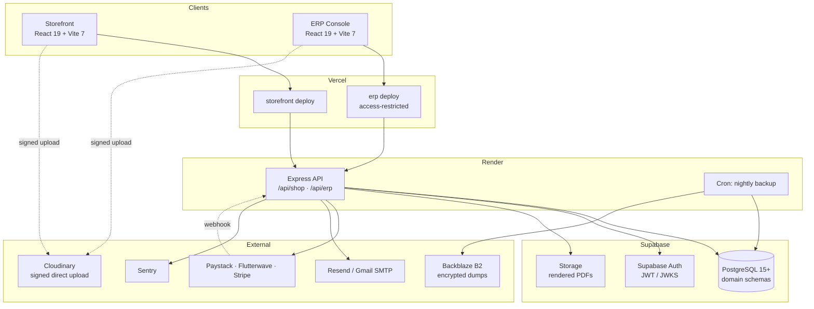

# 01 — System Overview

> Business context, system purpose, stakeholder matrix, and the technology ecosystem.

---

## 1. System purpose

EM Furniture & Interior is a furniture retail and interior-design business operating a showroom and a
bespoke design practice. The platform serves two commercially distinct activities that share a catalog,
a customer base, and a balance sheet:

- **Retail e-commerce** — browsing, cart, checkout, payment, delivery tracking for catalog furniture and
  curated collections.
- **Interior design projects** — consultation booking, designer assignment, room and floor-plan
  submission, quotation, deposit, execution, and installation.

The system today `[NOW]` is a competent storefront with a broad admin back-office. The system being built
`[TARGET]` is an ERP: one platform where every business event — a sale, a purchase, a stock movement, a
payment, an expense, a refund — is recorded once, in a place that always balances.

### What "ERP" means for this business specifically

Not SAP. The bar is: **a member of staff can answer "did we make money on that job?" without a
spreadsheet.** That single question requires cost prices, an expense ledger, project-level cost
attribution, and stock that moves when things are sold — none of which exist today.

---

## 2. Operating model

Single-branch operation (Nigeria, NGN), with a physical showroom, a warehouse, and a workshop for bespoke
pieces. Deliveries are domestic; payments are collected through Nigerian gateways with an international
card option. This is deliberately narrower than a multi-branch, multi-currency design — the schema should
not be *hostile* to a second location or currency, but nothing should be built for one today.

---

## 3. Stakeholder matrix

| Stakeholder | Primary interface | What they need from the system |
|---|---|---|
| Retail customer | Storefront | Browse, buy, track, download invoice, leave a review |
| Design client | Storefront + email | Book a consultation, upload room photos, receive and accept a quotation, pay a deposit, track a project |
| Sales officer | ERP console | Register enquiries, build quotations, convert to orders |
| Accountant | ERP console | Record payments and expenses, issue receipts and credit notes, reconcile the bank, close the month |
| Operations / warehouse | ERP console | Stock levels, goods receipt, picking, delivery scheduling |
| Interior designer | ERP console | Assigned consultations, project phases, room submissions |
| Content editor | ERP console | Blog, FAQs, banners, product copy and SEO |
| Business owner | ERP console | Revenue, **margin**, cash position, project profitability |
| External accountant / auditor | Exports | Trial balance, P&L, gapless invoice sequence, audit trail |

---

## 4. Platform scope

### In scope
Catalog and collections · CMS (blog, FAQ, projects, banners, SEO) · Cart, wishlist, guest checkout ·
Orders and fulfilment · Payments and refunds · Coupons, flash sales, loyalty · Reviews · Consultations and
designers · Interior projects as financial objects · Inventory and stock movements · Purchasing and
suppliers · Expenses and payables · Double-entry ledger and financial reporting · Documents (quotation,
invoice, receipt, credit note) · Analytics · Audit and activity logging · RBAC.

### Explicitly out of scope
Payroll and HR · Manufacturing resource planning / BOM explosion beyond simple bespoke job costing ·
Multi-currency · Multi-branch consolidation · Fixed-asset depreciation schedules · Tax filing submission
(the system produces the numbers; a human files them).

---

## 5. Technology ecosystem

---

## 6. Component matrix

`[NOW]` reflects `backend/package.json` and `frontend/package.json` at commit `8db2e2b`.

### Runtime and data

| Component | `[NOW]` | `[TARGET]` | Role |
|---|---|---|---|
| Node runtime | unpinned — **no `engines` field** `[GAP]` | Node 22 LTS, strict `engines` | Server execution and CI parity |
| Web framework | Express `^4.19.2` | Express `^4.19.2` | REST API, middleware orchestration |
| Database | MongoDB `^6.17.0` | PostgreSQL 15+ (Supabase) | Relational persistence, transactions, constraints |
| ORM / ODM | Mongoose `^8.16.1` | Sequelize `^6.37` + `pg` | Data mapping; raw SQL for ledger constraints |
| Migrations | none `[GAP]` | numbered SQL, idempotent | Controlled schema evolution |
| Auth | `jsonwebtoken` + `bcryptjs`, custom | Supabase Auth, JWKS verification | Token issuance, session, RBAC |
| Local dev DB | MongoDB Atlas / local | **PostgreSQL in Docker** — see §7 | Dev and test parity |

### Clients

| Component | `[NOW]` | `[TARGET]` | Role |
|---|---|---|---|
| UI framework | React `^19.1.0` | React `^19.1.0` | Both applications |
| Build | Vite `^7.0.0` | Vite `^7.0.0` | Two builds from one monorepo |
| Styling | Tailwind `^4.1.11` + daisyUI `^5.0.43` | unchanged | Semantic tokens, accessible components |
| State | Zustand `^5.0.6` | unchanged | Decoupled domain stores |
| Routing | React Router `^7.6.3` | unchanged | Admin routes already lazy-loaded |
| HTTP | Axios `^1.10.0` | generated `packages/api-client` | Type-safe calls from the OpenAPI spec |
| Rich text | TinyMCE `^6.2.1` | unchanged | Blog and product copy |
| Charts | **none** `[GAP]` | charting library, TBD | ERP reporting is unreadable without one |

### Services and operations

| Component | `[NOW]` | `[TARGET]` | Role |
|---|---|---|---|
| Media | Cloudinary `^2.7.0`, base64 through API `[GAP]` | Cloudinary signed direct upload | Zero binary payloads on the API |
| Payments | Paystack, Flutterwave, Stripe — **redirect verification only** `[GAP]` | + signed webhooks | Reliable payment capture |
| Tax | TaxJar, client-supplied amount `[GAP]` | server-side computation | Auditable tax figures |
| Email | Resend `^6.1.1`, `googleapis`, `nodemailer` | consolidate to one | Transactional email |
| PDF | Puppeteer `^24.40.0`, PDFKit `^0.17.2` | Puppeteer on Render (Docker) | Invoice and document rendering |
| API docs | hand-written `swagger.json` `[GAP]` | generated OpenAPI 3.1 + Postman | Specification that cannot drift |
| Testing | Jest `^29.7.0`, Vitest `^3.2.4` — **~2% real coverage** `[GAP]` | Jest + Supertest + Vitest + Playwright | See `docs/TESTING_STRATEGY.md` |
| Observability | `console.log` `[GAP]` | Sentry + Winston + Morgan | Structured logs, PII-scrubbed telemetry |
| CI/CD | **none** `[GAP]` | GitHub Actions | Lint, test, migration idempotency, spec drift |
| Hosting | single Render service | Vercel ×2 + Render + Supabase | See `docs/DEPLOYMENT.md` |
| Backup | Atlas snapshots | AES-256-GCM dumps → Backblaze B2 + PITR | See `docs/BACKUP_RUNBOOK.md` |

---

## 7. A deliberate divergence: no SQLite for dev and test

A common pattern — and one used by comparable ERP templates — is SQLite locally and PostgreSQL in
production, for zero-dependency development. **This project should not do that.**

The features this ERP depends on for correctness do not exist or behave differently in SQLite: `CHECK`
constraints with `DEFERRABLE`, `SELECT … FOR UPDATE` row locking (which gapless invoice numbering
requires), `JSONB` operators and indexes, partial and expression indexes, and true transactional DDL.
A ledger that balances under SQLite and silently fails to under Postgres is the worst possible outcome,
and it is exactly the class of bug a dialect-divergent test suite hides.

**Use PostgreSQL in Docker for development and CI.** It costs one `docker compose up` and removes the
entire category. SQLite would be a reasonable choice for an application without financial invariants;
this is not one.

---

## 8. Related documents

`02-repo-structure-and-modules.md` for the codebase map · `03-backend-architecture.md` for runtime detail ·
`05-erp-readiness-assessment.md` for every `[GAP]` above in full.
