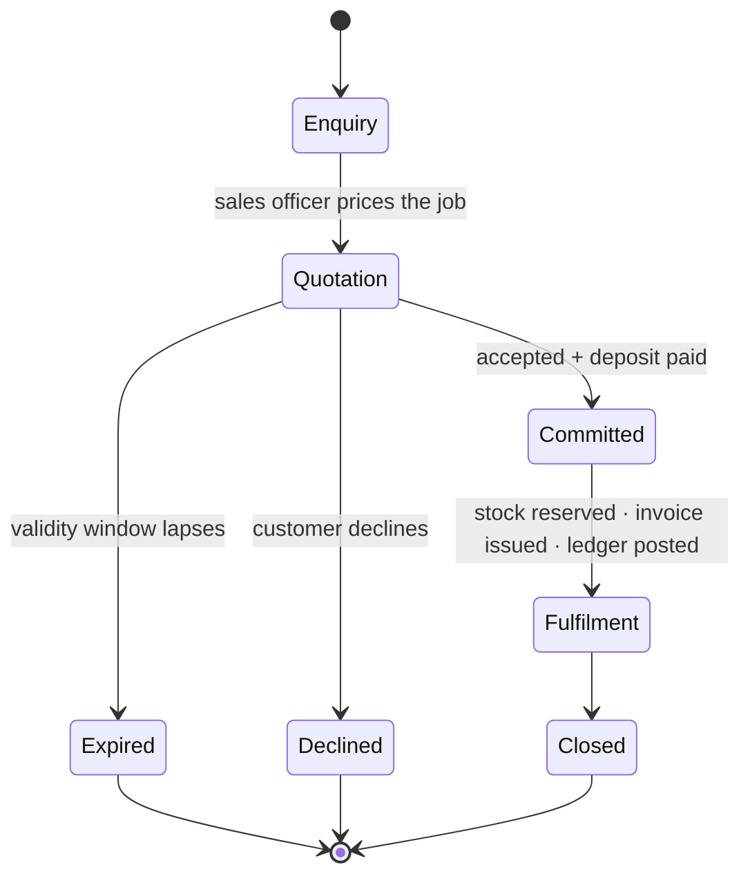
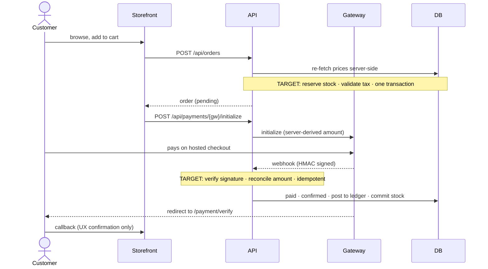
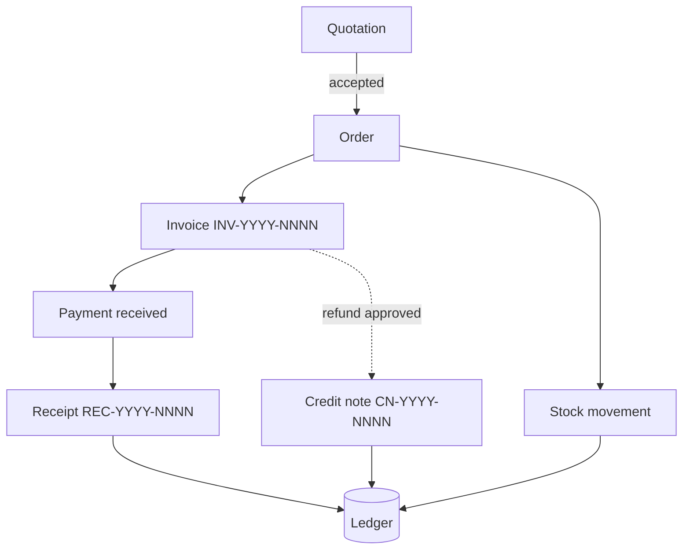
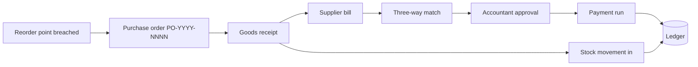
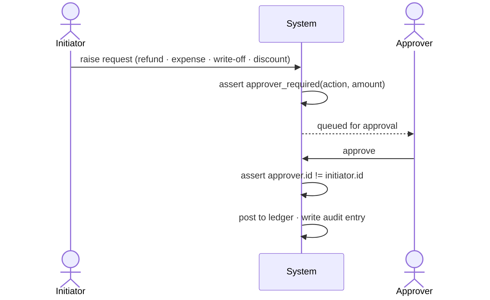

# 04 — Business Flow & Processes

> End-to-end operational workflows across retail and interior-design activity.
> Per-lifecycle detail lives in `context/lifecycles/`.

---

## 1. The two-phase commercial lifecycle `[TARGET]`

The central process rule. A commercial engagement exists in one of two phases, and the transition between
them is the only moment at which the business commits resources.

**Phase 1 — Offered.** A quotation exists. It is a document, a price, and a promise to hold that price
for a validity window. No stock is reserved, no revenue is recognised, no ledger entry is posted.

**Phase 2 — Committed.** The customer accepts and pays a deposit. Only now: stock is reserved, an order
is created, an invoice is issued, and the ledger posts. The Phase 1 quotation record is **retained, never
deleted** — it is the evidence of what was actually offered, and the denominator of every quote-conversion
metric.

`[NOW]` — neither phase is persisted. The Document Builder renders a quotation PDF and discards it
(F-07), so conversion rate is unmeasurable and the offer leaves no trace.

---

## 2. Retail purchase flow

`[NOW]` — the webhook leg does not exist. The dashed convenience path is the *only* path, which is F-01.
`[NOW]` — server-side price re-fetch is implemented and correct; tax and shipping are not (F-05).

---

## 3. Interior project flow

The commercially important flow, and the one the current system supports least as a *financial* process.

`[NOW]` — steps A–C are implemented (`consultationRequest`, `designer`, file upload, scheduling, status).
Steps D–J have no system representation at all: no project financial object, no budget, no cost
attribution, no cost-to-complete, no profit per job.

`[TARGET]` — the project becomes the object that costs attach to. Purchases, bespoke labour, delivery and
designer time all reference a project id, so the answer to "did we make money on that job?" is a query
rather than a spreadsheet. Detail in `context/lifecycles/project_lifecycle.md`.

---

## 4. Order-to-cash `[TARGET]`

**Credit-note rule.** An approved refund mints an immutable credit note linked to the original invoice,
reducing `total_amount` and `amount_paid` **simultaneously**, so the outstanding balance does not
artificially flag a refunded customer as a debtor. Corrections are never made by editing an invoice.

**Non-negative cash rule.** `recordPayment` rejects amounts ≤ 0. Every receipt represents money actually
received; negative adjustments are credit notes, which follow the approval path.

---

## 5. Procure-to-pay `[TARGET]`

Landed cost — freight, duty, clearing — is allocated across received lines at goods receipt, which is what
makes COGS and inventory valuation meaningful. Entirely absent today.

---

## 6. Period close `[TARGET]`

Monthly, by the accountant, approved by the managing director:

1. All payments and expenses for the period recorded.
2. Bank reconciliation complete.
3. Stock count differences posted as adjustments.
4. Trial balance reviewed — debits equal credits, or the close is blocked.
5. Period locked: no further postings with a date inside it. Corrections go to the open period as
   reversing entries.

Locking is what makes prior-period reports stable. Without it, last month's P&L changes every time
someone backdates an entry.

---

## 7. Approval flows `[TARGET]`

Every path below is enforced in the service layer, not the UI, and covered by a test. See
`02-repo-structure-and-modules.md` §4 for the full matrix.

The `approver.id != initiator.id` assertion holds for every role including `SUPER_ADMIN`. It is the first
control an auditor will ask about, and the cheapest to get right at the start.
