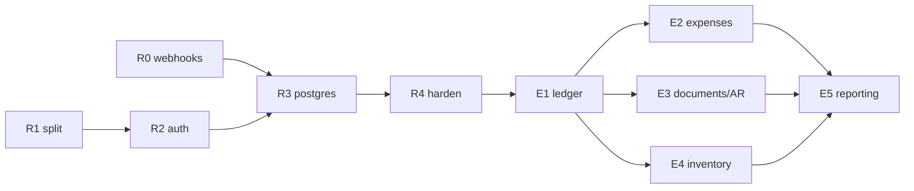

# 07 — Implementation Roadmap

> Combined sequencing for the replatform (`06`) and the ERP build (`05`), with effort and exit criteria.
> Effort assumes one experienced full-stack developer. Two developers is roughly 0.6×, not 0.5×.

---

## 1. Full sequence

| # | Phase | Effort | Cumulative |
|---|---|---|---|
| R0 | Payment webhooks — current stack ✅ **done** | 1 wk | 1 |
| R1 | Monorepo split — *CI landed ahead of this, see below* | 2–3 wks | 4 |
| R2 | Supabase Auth — still on MongoDB | 2–3 wks | 7 |
| R3 | PostgreSQL + Sequelize | 6–8 wks | 15 |
| R4 | Harden and document | 2–3 wks | 18 |
| E1 | Financial spine | 5–6 wks | 24 |
| E2 | Expenses and payables | 3–4 wks | 28 |
| E3 | Documents, receivables, projects | 4–5 wks | 33 |
| E4 | Inventory and purchasing | 4–5 wks | 38 |
| E5 | Reporting and CMS finish | 4–5 wks | 43 |

**≈ 33–43 weeks solo.** Eight to ten months alone, five to six with two developers.

The ERP phases are shorter than the estimates in `05` §4 (which assumed the current stack). Postgres
removes the hand-rolled integrity work from E1 and E4; Supabase removes auth work from E2's approval
flows; persisted documents in E3 become straightforward once there is a relational database. Net saving
is 6–8 weeks, which is roughly what the replatform costs beyond what was already needed.

---

## 2. Exit criteria

A phase is done when its criteria are demonstrably true, not when the code is written.

**R0 — Payment webhooks.** All three gateways deliver signed webhooks; signature verification rejects a
tampered payload in a test; a settled amount that disagrees with `order.totalAmount` does not mark the
order paid; replaying the same webhook twice produces one state change.

**R1 — Monorepo split.** Both apps build and deploy independently from one repository; the ERP app is
access-restricted and `noindex`; no console code appears in the storefront bundle; `packages/ui` is the
only source of shared components; and **visual regression tests pass against reference screenshots
captured before the split** — the UI must be pixel-identical, per `08-admin-ui-guidelines.md` §0.

**R2 — Supabase Auth.** Every existing user authenticates with their original password, no resets issued;
admin and customer sessions coexist without collision (closes F-10); guest carts survive conversion to a
registered account; RLS is enabled deny-all on every table.

**R3 — PostgreSQL.** The migration suite runs twice against a clean database with an identical result;
a production-snapshot rehearsal has been completed twice; a written rollback has been executed once;
row counts and financial totals reconcile between Mongo and Postgres; money is integer minor units
throughout; no `sync()` path exists in production code.

**R4 — Harden and document.** F-02, F-05, F-06, F-08, F-12, F-13 closed; integration tests cover every
route with at least an authorisation check and a happy path; CI runs lint, tests, migration idempotency
and OpenAPI drift on every push; `TESTING.md` and `FEATURES.md` reflect reality.

**E1 — Financial spine.** A confirmed order posts a balanced journal entry automatically; the trial
balance nets to zero; COGS posts on every sale and gross margin is queryable; a closed period rejects
postings dated inside it.

**E2 — Expenses and payables.** An expense can be raised, approved by a different actor, and posted; the
P&L shows profit rather than takings; aged payables reconcile to the supplier bill ledger.

**E3 — Documents, receivables, projects.** Every quotation and invoice is persisted with gapless
numbering; a quotation converts to an invoice without re-keying; aged receivables are queryable;
profit per project is a single query.

**E4 — Inventory and purchasing.** Stock is derived from an append-only movement log; a sale reserves and
then decrements it; a purchase order flows through goods receipt to a supplier bill with landed cost
allocated; inventory valuation feeds the balance sheet.

**E5 — Reporting and CMS.** P&L, balance sheet, cash flow and tax summary all derive from the ledger and
export; content can be drafted, scheduled and reverted.

---

## 3. Dependencies

R0 is independent and ships immediately. R1 → R2 → R3 → R4 is strictly serial. E2, E3 and E4 all depend
on E1 but not on each other, so they are where a second developer first pays for themselves.

---

## 4. Decisions still open

| Decision | Options | Recommendation | Deadline |
|---|---|---|---|
| Sequelize reading | as stated / something else | Confirm §1 of `06` | Before R3 |
| Build vs integrate the ledger | own ledger / QuickBooks / Zoho | Build — project-level costing is handled badly by generic books, and the sync is work either way | Before E1 |
| Polymorphic modelling | supertype table / two nullable FKs + CHECK | Supertype table | Before R3 |
| Dark theme for the console | after R4 / never | After R4 — it is a visual change, excluded from the replatform by the UI-parity constraint | Before E5 |
| Charting library | TBD | Pick before E5 designs begin | Before E5 |
| Who actually uses the ERP | owner only / small office / with external accountant | Answer decides how much approval machinery E1–E2 need | Before E1 |

---

## 4b. Completed ahead of schedule

**CI** (`.github/workflows/ci.yml`) was brought forward from R4, because R0 produced a test suite worth
protecting and every later phase benefits from a gate that already exists. Three jobs run on every push:

| Job | Gate |
|---|---|
| Backend | 40 Jest tests against a real in-memory MongoDB |
| Frontend | Per-file ESLint ratchet, 41 Vitest tests, production build |
| API spec | OpenAPI and Postman parse; every payments route is documented; removed gateways stay removed |

The lint gate is a ratchet rather than a zero-error rule: the frontend carries 68 pre-existing errors, and
gating on zero would have made CI red on arrival. Counts are held per file and may only fall
(`.github/lint-baseline.json`, `.github/scripts/lint-ratchet.mjs --update`).

Still missing from the R4 target: migration idempotency and OpenAPI drift checks (both need R3), visual
regression (needs R1), and a coverage floor (needs meaningful coverage first).

## 5. Standing risks

**Scope creep during R3.** The single largest threat to this plan. See `06` §8.

**The system stays live throughout.** Every phase must ship behind the ability to serve customers. R3 is
the only phase requiring a maintenance window, and it must be rehearsed twice.

**Documentation drift.** This suite is only useful if `[NOW]` tags stay true. Update the relevant document
in the same pull request as the change, and treat a stale `[NOW]` as a bug.

**Single-developer bus factor.** With one developer this is an eight-to-ten-month critical path with no
redundancy. The generated OpenAPI spec, the test suite, and this suite are the mitigations — they are what
make the work transferable.
