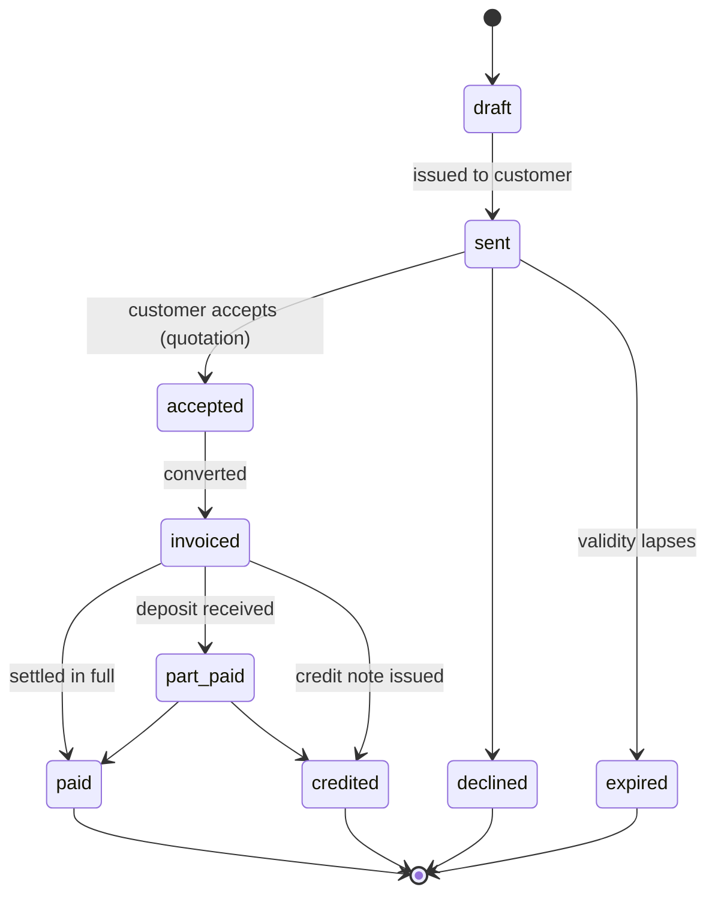

# Document Lifecycle

> Quotation → invoice → receipt → credit note. Numbering, states, and immutability rules.
> Closes finding F-07.

---

## 1. Current state `[NOW]`

`document.controller.js` validates a payload, renders a PDF through Puppeteer, and returns it. There is
**no document model, no persistence, no numbering**. Every quotation ever issued is gone. You cannot list
what was offered, see what converted, chase an unpaid invoice, or reissue a copy.

For a business running interior projects on quotes and deposits this is the single largest missing piece
of day-to-day value, and it is where accounts receivable has to live.

## 2. Document types `[TARGET]`

| Type | Prefix | Binding | Posts to ledger |
|---|---|---|---|
| Quotation | `QUO-YYYY-NNNN` | No — an offer with a validity window | No |
| Proforma invoice | `PRO-YYYY-NNNN` | No — a request for payment | No |
| Invoice | `INV-YYYY-NNNN` | Yes | Yes — receivable + revenue |
| Receipt | `REC-YYYY-NNNN` | Evidence of money received | Yes — cash + receivable reduction |
| Credit note | `CN-YYYY-NNNN` | Yes | Yes — contra-revenue |

## 3. State machine `[TARGET]`



`draft` is the only mutable state. Once a document is `sent` it is immutable: an amendment creates a new
version, retaining the original, because the customer already has a copy of it.

## 4. Gapless numbering `[TARGET]`

**Do not use a PostgreSQL sequence.** Sequences skip numbers on rollback, and gapless numbering is a
common statutory requirement for invoices — an auditor asking why `INV-2026-0041` does not exist is not a
conversation worth having.

```
BEGIN;
  SELECT next_value FROM fin_document_counters
   WHERE doc_type = 'INV' AND year = 2026
     FOR UPDATE;                          -- serialises concurrent issuance
  UPDATE fin_document_counters SET next_value = next_value + 1 …;
  INSERT INTO fin_documents (…, number) VALUES (…, 'INV-2026-0042');
COMMIT;                                   -- number and document commit together
```

The row lock serialises issuance, so two simultaneous requests cannot take the same number, and a rollback
returns the number to the pool. Slower than a sequence and correct — and very annoying to retrofit once
several hundred invoices exist.

Counters reset per type per year. Quotations may be gapped; invoices, receipts and credit notes may not.

## 5. Schema sketch `[TARGET]`

`fin_documents` — id, type, number, version, status, customer ref, project ref, order ref, currency,
subtotal, discount, tax, total, amount_paid, valid_until, issued_at, issued_by, superseded_by, pdf_asset_id.

`fin_document_lines` — id, document_id, sequence, description, quantity, unit_price, line_total, tax_rate,
sellable_item_id (nullable — bespoke lines have no catalog item), project_phase.

`fin_document_counters` — doc_type, year, next_value.

All money in integer minor units.

## 6. Rendered PDF storage `[TARGET]`

Render once, on issue, and store in Supabase Storage. Serve by signed URL from the stored asset, never by
re-rendering. A regenerated PDF can differ from the one the customer holds — a changed template, logo or
tax rate is enough — and the document handed to an auditor must be byte-identical to the one sent.

Store the template version alongside the asset so a historical document can be explained.

## 7. Credit note rules `[TARGET]`

An approved refund mints an immutable credit note linked to the original invoice. It reduces
`total_amount` **and** `amount_paid` simultaneously, so the outstanding balance does not artificially flag
a refunded customer as a debtor.

Invoices are never edited to correct an error. The correction is a credit note plus, where appropriate, a
replacement invoice. Both remain in the sequence, and the trail explains itself.
