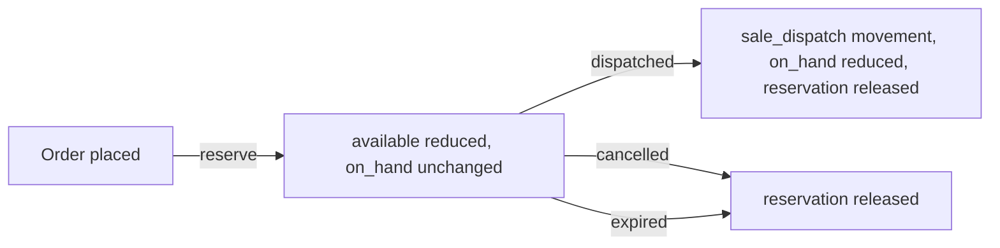

# Inventory Lifecycle

> Stock movements as events, reservation, valuation, and the link to the ledger.

---

## 1. Current state `[NOW]`

`product.stockQuantity` is a single mutable number per product. The only thing that changes it is an
admin editing the Inventory screen (`inventory.controller.js:62–81`), which writes an
`inventoryAdjustment` audit row. Selling a product does not decrement it (F-02), and there is no
availability check at checkout.

Inventory is therefore a manual spreadsheet with an audit trail, permanently drifting from reality. There
is also no cost price (F-03), so stock has no value — inventory cannot appear on a balance sheet.

`sku` is an unconstrained string (F-12); duplicate SKUs are possible, which breaks anything keyed on them.

## 2. Movements as events `[TARGET]`

Current stock stops being a stored number and becomes a **derived value over an append-only movement
log**. This is the single most important structural change in the inventory module: a mutable counter
cannot be audited, reconciled, or explained, and every stock discrepancy becomes unanswerable.

```
on_hand(item, location) = Σ inv_stock_movements.quantity
available(item, location) = on_hand − reserved
```

| Movement type | Sign | Trigger |
|---|---|---|
| `goods_receipt` | + | Purchase order received |
| `sale_dispatch` | − | Order dispatched |
| `return_restock` | + | Return inspected and saleable |
| `transfer_out` / `transfer_in` | − / + | Between locations |
| `count_adjustment` | ± | Stock take variance |
| `write_off` | − | Damage, loss, shrinkage — requires approval |
| `production_consume` / `production_output` | − / + | Bespoke build |

Movements are immutable. A mistake is corrected by a compensating movement with a reason, never by
editing history. A materialised current-stock view keeps reads fast.

## 3. Reservation `[TARGET]`



Reserving at order time prevents overselling; decrementing only at dispatch keeps physical and system
stock aligned. Reservations for unpaid orders expire on a timer so abandoned checkouts do not hold stock
indefinitely.

## 4. Locations `[TARGET]`

Showroom, warehouse, workshop — and stock in transit between them. `warehouseLocation` is currently a
free-text string on the product; it becomes a foreign key to `inv_locations`, and every movement carries
one. Multi-location is cheap to design in now and expensive to retrofit, because every historical movement
would need a location assigned retrospectively.

## 5. Valuation `[TARGET]`

**Weighted average cost.** FIFO is more precise and materially more complex; for a business of this size
weighted average is the pragmatic and defensible choice.

Each `goods_receipt` updates the weighted average for the item, including allocated landed cost — freight,
duty and clearing spread across received lines by value. Each `sale_dispatch` posts COGS at the prevailing
weighted average.

This is what makes gross margin real, and what lets inventory appear on the balance sheet at a defensible
number.

## 6. Ledger integration `[TARGET]`

| Movement | Debit | Credit |
|---|---|---|
| `goods_receipt` | Inventory | Accounts payable |
| `sale_dispatch` | COGS | Inventory |
| `write_off` | Stock loss expense | Inventory |
| `count_adjustment` (+/−) | Inventory / Stock variance | Stock variance / Inventory |

Every movement that changes inventory value posts a balanced journal entry in the same transaction. If
the posting fails, the movement does not happen — that is the invariant that keeps the stock ledger and
the general ledger reconciled.

## 7. Stock takes `[TARGET]`

A count is a first-class object: a scoped snapshot of expected quantities, counted values entered per
line, variances calculated, and a single approved posting of `count_adjustment` movements. Variance above
a threshold requires manager approval. Ad-hoc quantity editing — the only mechanism that exists today —
is removed entirely.

## 8. Reorder points `[TARGET]`

`lowStockThreshold` already exists per product and drives a low-stock view. Extended with lead time and
average consumption, it becomes a reorder suggestion feeding purchase order creation, closing the loop
between inventory and purchasing.
