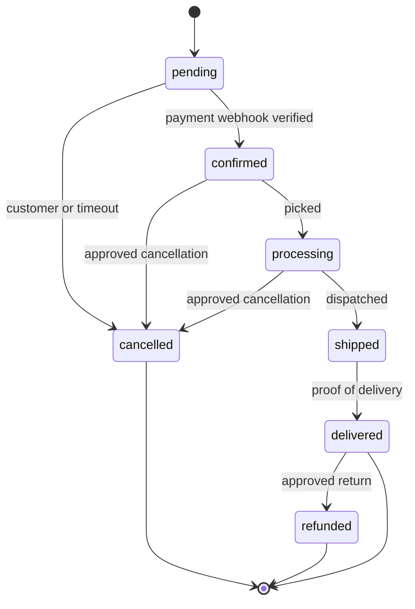

# Order Lifecycle

> Status machine, transition rules, and the side effects each transition must produce.

---

## 1. Statuses `[NOW]`

`order.model.js` defines seven statuses and four payment statuses:

`pending` · `confirmed` · `processing` · `shipped` · `delivered` · `cancelled` · `refunded`
Payment: `pending` · `paid` · `failed` · `refunded`

A `pre('save')` hook appends to `statusHistory` on every status change — a good foundation that already
gives an audit trail. What is missing is any notion of which transitions are *legal*: today any status can
become any other, and nothing else happens as a result.

## 2. Transition machine `[TARGET]`

**Rules.**
- `pending → confirmed` happens **only** on a verified gateway webhook or an accountant recording an
  offline payment. Never from a browser callback (F-01).
- Backward transitions are prohibited. A mistake is corrected by cancelling or refunding, which leaves a
  record, not by moving the status back.
- `cancelled` and `refunded` are terminal.
- Every transition records actor, timestamp and reason in `statusHistory`.

## 3. Required side effects `[TARGET]`

The gap that matters most: today a status change changes a string and nothing else.

| Transition | Stock | Ledger | Notification |
|---|---|---|---|
| `→ pending` | reserve | none | customer, staff |
| `pending → confirmed` | hold reservation | recognise revenue, post COGS, post tax liability | customer + invoice |
| `confirmed → processing` | — | — | — |
| `processing → shipped` | **decrement** on dispatch, release reservation | — | customer + tracking |
| `shipped → delivered` | — | — | customer, review request |
| `* → cancelled` | release reservation | reverse any posting | customer, staff |
| `delivered → refunded` | increment on physical return only | credit note, reverse revenue and COGS | customer + credit note |

**Reserve on order, decrement on dispatch.** Reserving at order time stops overselling; decrementing only
at dispatch keeps physical stock and system stock aligned, because that is the moment the item actually
leaves. Available-to-promise is `on_hand − reserved`.

## 4. Atomicity `[TARGET]`

Order creation currently increments coupon usage at `order.controller.js:97` and saves the order at
`:140` with nothing spanning them (F-06). In the target, one transaction covers: price re-fetch, stock
reservation, coupon increment, order insert, document insert, ledger posting. Any failure rolls back all
of it.

An idempotency key supplied by the client and stored with a unique index makes a double-submitted
checkout return the original order rather than creating a second one.

## 5. Cancellation and returns `[TARGET]`

Cancellation before dispatch is a status change plus a reservation release. A **return** after delivery is
a separate object — it has its own approval path (segregation of duties: raised by customer service,
approved by the accountant), its own inspection step, and only increments stock when the goods are
physically received back and found saleable. Damaged returns increment nothing and post a write-off.

Collapsing returns into the order status is the mistake to avoid: a return has a lifecycle of its own and
a financial consequence that outlives the order.
