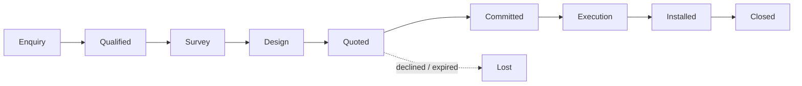

# Interior Project Lifecycle

> Consultation through installation, and the transformation of a project into a financial object.

---

## 1. Current state `[NOW]`

`consultationRequest.model.js` and `designer.model.js` cover intake well: budget range, style preference,
room photo and floor-plan upload, designer assignment, scheduling, and status tracking. Designer
performance analytics exist.

What does not exist is any notion of a project as a thing that **costs money and earns margin**. There is
no budget, no quotation link, no purchase attribution, no labour, no cost-to-complete, and no profit per
job. For a business where bespoke interior work is the higher-margin activity, this is the largest
commercial blind spot in the system.

## 2. Phases `[TARGET]`

Eight phases, sequentially advanced, each with an entry condition. One-step rollback is permitted with a
reason; arbitrary jumps are not.

| # | Phase | Entry condition | Financial effect |
|---|---|---|---|
| 1 | Enquiry | Consultation request received | none |
| 2 | Qualified | Designer assigned, budget band confirmed | none |
| 3 | Survey | Site visit completed, measurements and photos on file | designer time logged |
| 4 | Design | Proposal presented | designer time logged |
| 5 | Quoted | Quotation issued (`QUO-YYYY-NNNN`) | committed budget recorded, nothing posted |
| 6 | Committed | Quotation accepted **and** deposit received | deposit invoice posted, stock reserved, POs may be raised |
| 7 | Execution | Procurement and bespoke build underway | purchases, labour and landed cost attributed to the project |
| 8 | Installed | Delivery and installation signed off | final invoice issued, revenue and COGS recognised |
| — | Closed | Balance settled, retention released | project margin final |

**Phase 5 → 6 is the two-phase commit** described in `04-business-flow-and-processes.md` §1. Before it,
nothing is reserved and nothing is posted. After it, the business is committed. A project that never
crosses it is retained as `Lost` with its quotation intact — that record is the denominator of the
conversion rate.

## 3. Gate conditions `[TARGET]`

- **Phase 6** requires an accepted quotation and a received deposit. Not one or the other.
- **Phase 7** blocks purchase orders that would take committed cost above the quoted value without a
  variation order and manager approval. This is the control that stops a job quietly going underwater.
- **Phase 8** requires a signed installation sign-off on file.
- **Closed** requires zero outstanding balance, or an approved write-off.

## 4. Cost attribution `[TARGET]`

The whole point. Every cost-bearing object carries an optional `project_id`:

| Source | Attribution |
|---|---|
| Purchase order / supplier bill | direct material cost |
| Stock issued from inventory | at weighted-average cost |
| Bespoke workshop labour | hours × rate, logged per phase |
| Designer time | hours × rate, from phase 3 onward |
| Delivery and installation | direct cost |
| Landed cost on imported items | allocated at goods receipt |

Project margin is then `revenue recognised − attributed cost`, queryable at any phase — which makes
cost-to-complete and mid-job profitability real rather than estimated.

## 5. Variation orders `[TARGET]`

Scope changes mid-project are where bespoke work loses money. A variation order is a first-class object:
described, priced, approved by the client, and appended to the project's committed value. Execution work
outside an approved variation is a control failure, and the phase-7 gate is what surfaces it.

## 6. What to build first

Phases 1–4 already exist in substance. The highest-value increment is **phase 5 and 6**: persist the
quotation (`lifecycles/document_lifecycle.md`), link it to the consultation, and record acceptance and
deposit. That alone turns an untracked pipeline into a measurable one, before any ledger work.
