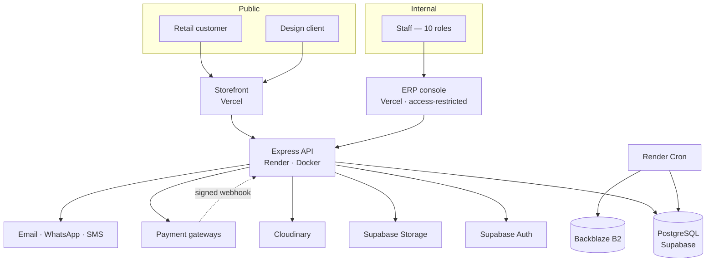
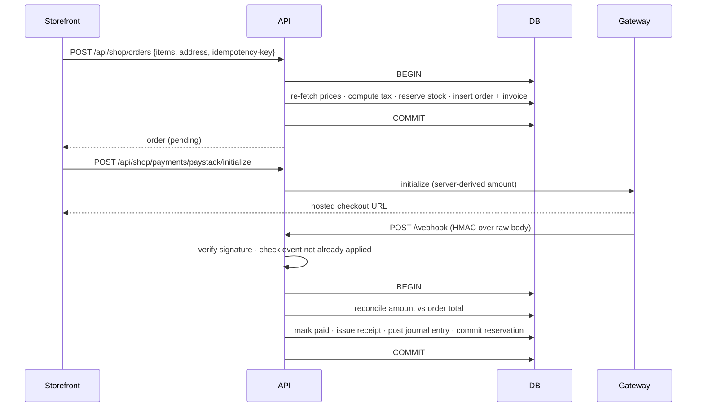

# Solution Architecture

> Target topology, trust boundaries, and the reasoning behind each structural choice.
> Current-state detail is in `context/03-backend-architecture.md`.

---

## 1. Context

---

## 2. Structural decisions

### One API, two clients

Both applications hit the same database and the same domain logic. Two backends would mean two copies of
pricing and order rules, which is how they drift apart. One Express deployment with `/api/shop` and
`/api/erp` namespaces, differentiated by middleware, keeps the domain in one place while still allowing
the two surfaces to be secured, rate-limited and versioned differently.

### Two frontends, separately deployed

The console is a separate Vercel project so it can be access-restricted and kept out of search indexes.
Serving it from the storefront origin makes it internet-reachable by definition. The split is cheap
because every admin route is already lazy-loaded.

### Express, not a rewrite

The middleware design — permission resolution per request, composable `requirePermissions`, rate limiters
per route class, audit and activity middleware — is the strongest part of the current backend. There is
no reason to change frameworks, and doing so during a database migration would violate the one-change-at-a-time
rule that governs the whole plan.

### PostgreSQL, not MongoDB

A general ledger must always balance. That is enforceable with deferred constraint triggers, row locking
and transactional DDL, and is not enforceable in application code alone under concurrency. Every other
argument (relational reporting, joins, `SELECT … FOR UPDATE` for gapless numbering) is secondary to that
one.

### Authorization in the application, not in RLS

RLS is per-row and per-user. These rules are per-action and involve business logic: approval thresholds,
period locks, posting rules, and a no-self-approval check on actor identity. Express is the only database
client, using the service role. RLS is enabled deny-all as defence in depth, so a leaked anon key is not a
breach.

---

## 3. Trust boundaries

| Boundary | Control |
|---|---|
| Browser → API | Supabase JWT verified against JWKS; CORS allowlist of exactly two origins; per-route rate limits |
| Storefront → ERP data | Namespace separation plus permission checks; no shop route reads a `fin_` table |
| API → database | Service role only; no client ever holds database credentials; RLS deny-all beneath |
| Browser → Cloudinary | Short-lived signed signature scoped to an allowlisted asset kind; API never receives binary bodies |
| Gateway → API | HMAC signature over the raw request body; idempotent handlers; amount reconciled against the order |
| Staff → financial mutation | Permission check, then segregation of duties: approver identity ≠ initiator identity |
| API → Sentry | Request bodies, auth headers and query parameters stripped before dispatch |

The two boundaries most often got wrong here are the gateway webhook (verify against the **raw** body —
`express.json()` re-serialisation breaks the signature) and the Cloudinary signature (constrain asset
kind, size and format in the signature, not only in the client).

---

## 4. Data flow: an order becoming money

Every invariant this system depends on lives in that second transaction: the amount check (F-09), the
idempotent replay guard (F-01), and the balanced ledger posting. It is the highest-value thing in the
codebase to test.

---

## 5. Failure modes designed for

| Failure | Response |
|---|---|
| Customer closes the tab after paying | Webhook confirms independently — the browser callback is UX only |
| Gateway delivers the same webhook twice | Event key with a unique index; second delivery is a no-op |
| Two staff issue an invoice simultaneously | `SELECT … FOR UPDATE` on the counter row serialises numbering |
| Order creation fails partway | One transaction; coupon usage and stock reservation roll back with it |
| Ledger entry does not balance | Deferred constraint trigger rejects the commit |
| Backdated posting into a closed period | Trigger rejects it; correction goes to the open period |
| Render instance restarts mid-request | Stateless API; idempotency keys make client retries safe |
| Supabase unavailable | API returns 503 with a correlation id; no partial writes, because everything is transactional |
| Provider loss | Encrypted off-provider backups — `BACKUP_RUNBOOK.md` |

---

## 6. Known compromises

**Puppeteer in the API process.** PDF rendering is memory-heavy and shares a process with request
handling. Accepted for now because a separate rendering service is more infrastructure than the volume
justifies. Revisit if PDF generation starts affecting API latency — the boundary is already clean enough
to extract.

**One API for two very different consumers.** The storefront is high-volume and simple; the console is
low-volume and complex. Sharing one deployment means they share a scaling profile. Acceptable at this
size, and the namespace split means separating them later is a deployment change, not a rewrite.

**Weighted-average valuation, not FIFO.** Less precise, materially simpler. Defensible for this business;
would need revisiting under inventory-heavy import operations.

**No multi-currency.** NGN only. The schema stores minor units with an explicit currency column so the
door is not bolted shut, but nothing else accommodates it.
